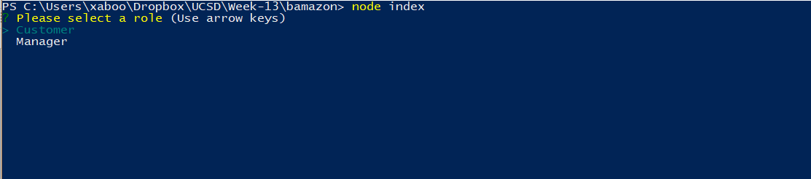

# Bamazon #

A Node.js Command Line App that allows either a customer, manager, or supervisor to do various functions.

## Starting the App ##

From the command line, run `node index` to start the app.

Select a role to use.

##  Bamazon Role: Customer ##
### View and Purchase Items ###
Allows a user with the role of `Customer` to view items and purchase a quantity.

View Items

Purchase Items

Confirmation after items are purchased

Message if items purchased do not have enough inventory

##  Bamazon Role: Manager ##

### View and Purchase Items ###
Allows a user with the role of `Manager` to `View Inventory`, `View Low Inventory`, `Add to Inventory` and `Add a New Product`.

### `View Inventory` & `View Low Inventory` ###

Report shows for Inventory

### `Add to Inventory` ###

Add Inventory amount

Confirmation of new inventory

### `Add a New Product` ###

Form to Add a new Product

Confirmation of new Product

